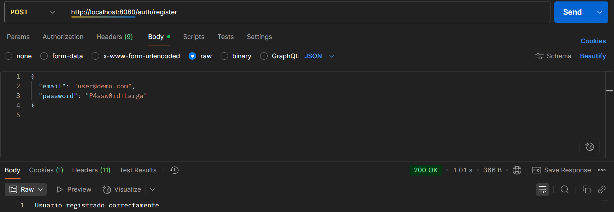
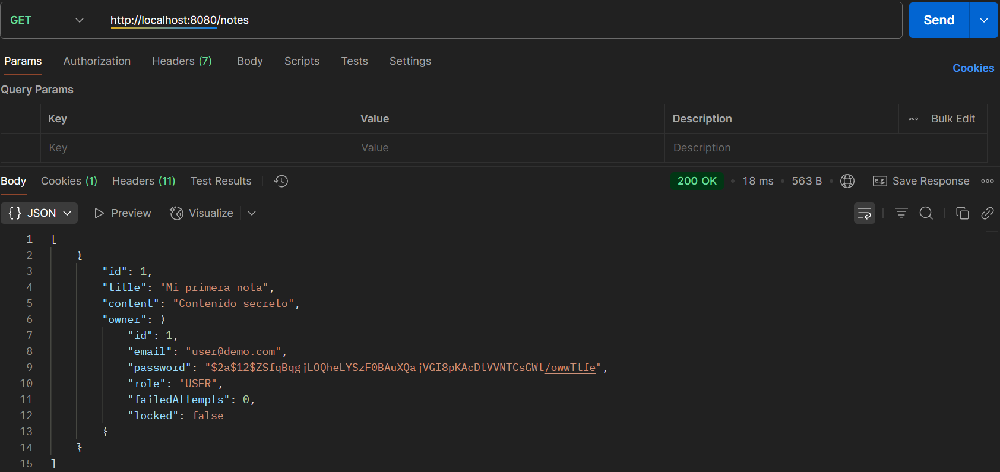

# Notas Privadas Seguras

Aplicación de notas seguras desarrollada en **Spring Boot**, con registro, login y CRUD de notas.  
Incluye validaciones, hashing de contraseñas y control de sesiones.

---

## 🔹 Requisitos

- Java 24
- Maven 4 (o compatible)
- IDE: IntelliJ IDEA (Community o Ultimate)
- Postman (para pruebas de API)
- Git (opcional, para clonar el proyecto)

---

## 🔹 Instalación / Cómo correr

1. Clonar el repositorio:

```bash
git clone https://github.com/Sabogal22/notas-seguras.git
cd notas-seguras
```

2. Compilar y correr el proyecto con Maven:

```bash
./mvnw clean install
./mvnw spring-boot:run
```

> Si estás en Windows, usa `mvnw.cmd` en lugar de `./mvnw`.

3. La aplicación correrá en:  
```
http://localhost:8080
```

---

## 🔹 Endpoints disponibles

### **Auth**

| Método | Ruta | Descripción |
|--------|-----|-------------|
| POST   | `/auth/register` | Registrar usuario nuevo |
| POST   | `/auth/login`    | Login usuario |
| GET    | `/auth/me`       | Obtener info del usuario logueado |

**Formato de registro:**

```json
{
  "email": "user@demo.com",
  "password": "P4ssw0rd+Larga"
}
```

**Formato de login (POSTMAN, x-www-form-urlencoded o params):**

- `username` = email
- `password` = contraseña

---

### **Notas**

> Todos requieren sesión activa (login).

| Método | Ruta | Descripción |
|--------|-----|-------------|
| POST   | `/notes`        | Crear nota |
| GET    | `/notes`        | Listar notas propias |
| GET    | `/notes/{id}`   | Obtener nota por ID |
| PUT    | `/notes/{id}`   | Actualizar nota por ID |
| DELETE | `/notes/{id}`   | Eliminar nota por ID |

**Formato de nota:**

```json
{
  "title": "Título de la nota",
  "content": "Contenido de la nota"
}
```

---

## 🔹 Usuarios de demo

| Email          | Password | Rol   |
|----------------|----------|-------|
| user@demo.com  | P4ssw0rd+Larga | USER  |
| admin@demo.com | P4ssw0rd+Larga | ADMIN |

> Antes de probar con Postman, primero registra el usuario mediante `/auth/register`.

---

## 🔹 Validaciones importantes

- Email válido y único.
- Contraseña con:
  - Mínimo 10 caracteres
  - Al menos una letra mayúscula
  - Al menos una letra minúscula
  - Al menos un número
- Control de sesión: solo el dueño puede ver, actualizar o eliminar sus notas.

---

## 🔹 Notas finales

- Para pruebas, deshabilitamos CSRF y login forms por simplicidad.  
- Las contraseñas se guardan con **BCrypt**.  
- Se recomienda crear una base de datos persistente para producción (ahora usa H2 en memoria).  

---
## 🔹 Capturas

### **Registro**

---
### **Login**

---
### **Notas**


---

### ✅ Autor

**Neythan Sabogal Gaitan**

